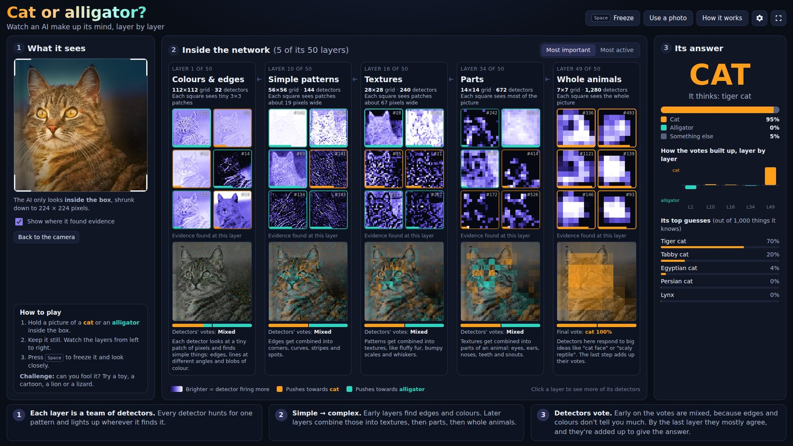
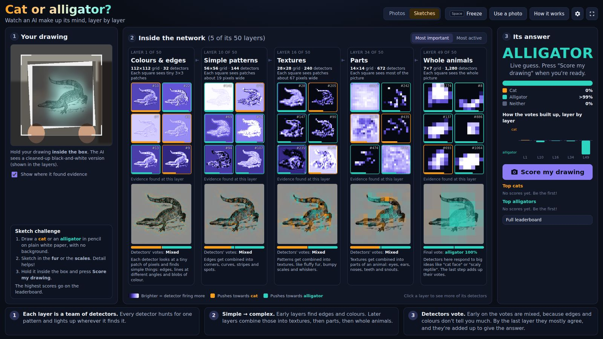
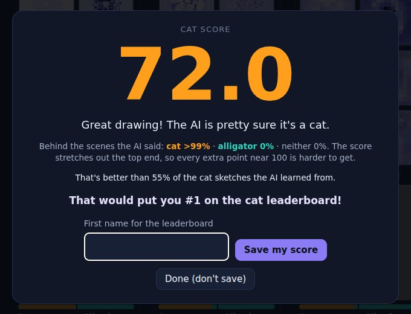

# Cat or Alligator? Inside an AI's layers

A webcam demo for open mornings. Hold up a picture of a **cat** or an **alligator** and watch a real neural network make up its mind, layer by layer.

The screen reads left to right:

1. **What it sees.** The live webcam, with a box showing the part of the picture the AI looks at. A spotlight shows where it found its evidence.
2. **Inside the network.** Five of the network's 50 layers, from shallow to deep. Each layer's grid is half the size of the one before (112 → 56 → 28 → 14 → 7), so each square covers more of the picture:
   - **Colours & edges** (layer 1). Detector outputs look like edge-detected copies of the photo.
   - **Simple patterns** (layer 10). Stripes, corners and curves.
   - **Textures** (layer 16). Fur, scales and whiskers.
   - **Parts** (layer 34). Blobs over eyes, ears, snouts and teeth.
   - **Whole animals** (layer 49). A 7×7 grid of "big idea" detectors.

   Each layer shows its six most important **detectors** (brighter means firing more). Orange borders vote **cat** and teal borders vote **alligator**. Below them, an **evidence map** shows where in the photo that layer found cat or alligator evidence. Early layers are a speckly mix. By the last layer there's a clear blob over the animal.
3. **Its answer.** The verdict, a cat / alligator / something-else bar, a chart of how the votes built up across the layers, and the top 5 of the 1,000 things it knows.

Click any layer, or press **1**–**5**, to see 40 of its detectors. Click a detector to see exactly where in the picture it fires.

## Sketch mode: the drawing challenge

Switch to **Sketches** (top right, or press **K**). Students draw a **cat** or an **alligator** in pencil on plain white paper, sketching in the fur or scales, with no background. They hold it up and press **Score my drawing** (or **Enter**):

1. The app takes about 10 frames over a second and keeps the **sharpest** one. It then asks **"Is this your drawing?"**, showing what the camera saw next to the cleaned-up version the AI will use. It warns if the picture is blurry, too dark or empty.
2. The student confirms by saying what they drew: **It's a cat** (**C**) or **It's an alligator** (**A**). If they're not happy, they press **No, try again** (**R**).
3. The AI gives a **score out of 100** with one decimal place. The scale is stretched at the top, so drawings don't all tie at 99. A typical sketch gets about 70, and 90+ is exceptional. It also says how the drawing compares with the sketches the AI learned from.
   
4. They type a first name to go on the **leaderboard**, which shows the top 5 cats and top 5 alligators with thumbnails of the drawings. **Full leaderboard** shows the top 30 of each. From there you can remove a single entry, **download everything as a CSV**, or clear the board. Scores are saved in the browser, so they survive a page reload, but they only exist on that one computer.

The layers still work in sketch mode. They show the cleaned-up drawing, and the votes come from the sketch classifier.

**How it can read sketches:** the photo AI is poor at pencil drawings, so sketch mode adds one small extra layer. It was trained on about 3,700 drawings found online: ImageNet-Sketch pencil sketches, Google Quick, Draw! doodles, freely licensed drawings and "neither" pages. On held-out real sketches it tells cats from alligators about 93% of the time. The camera image is cleaned up first: the background and hands are removed, shadows are evened out, and it zooms in on the pencil marks. Details and re-training steps are in [`tools/sketch/README.md`](tools/sketch/README.md).

**Tips:** use white paper, a soft pencil (HB–2B) pressed firmly, and a drawing that fills most of the page. Hold it still and square to the camera in good light. Have a pile of paper and pencils at a table next to the screen.

## Running it

It's a static website: plain HTML and JavaScript using [TensorFlow.js](https://www.tensorflow.org/js). There's no Python, no installing and no server-side code. The AI runs on the computer's graphics card inside the browser, and **no images leave the computer**.

Use **Chrome or Edge** on a computer with a webcam.

### Option A: GitHub Pages (online)

1. On GitHub, open the repo's **Settings → Pages**.
2. Under *Build and deployment*, choose **Deploy from a branch**, branch **main**, folder **/ (root)**, then click **Save**.
3. After a minute it will be live at **https://bakerpdgit.github.io/AI-Visualisation-Demo/**.

Webcams work on GitHub Pages because it uses https.

### Option B: on the PC, offline (recommended on the day)

Everything the demo needs, including the AI model (about 9 MB) and TensorFlow.js, is in this folder, so it works with no internet connection.

- **Windows:** double-click **`start-demo.bat`**. It opens the demo at `http://localhost:8000/`. Leave the black window open while you use it. It uses Python if it's installed, and otherwise falls back to a built-in Windows (PowerShell) web server.
- **Mac/Linux:** run `./start-demo.sh`.

Double-clicking `index.html` won't work. Browsers block webcams and model files on pages opened straight from disk.

The first time, the browser will ask for permission to use the camera. Click **Allow**.

## Tips for the open morning

- **Pictures:** print photos of cats and alligators at A5 or A4 size on **matt** paper. Glossy paper and screens reflect lights. The animal should fill most of the box. Close-ups of faces work best. Also print a few "tricky" ones: a lion, a lizard, a crocodile, a cartoon cat, a dog, a crocodile-skin handbag.
- **Camera:** a USB webcam on a stand or clamp, pointing at where visitors will hold the picture, works better than a laptop's built-in camera. Choose it in **Settings** (⚙). Even, bright lighting helps a lot.
- **Screen:** press **F** for full screen. The layout is designed for a 16:9 screen (1080p is ideal) and also works at 1366×768.
- **Presenting:** press **Space** to **freeze** a frame, then talk through the layers. Click a layer to open its detectors. **Most important** shows the detectors that most affected the answer. **Most active** shows the ones firing hardest.
- **No camera?** Click **Use a photo** to try the built-in sample photos, choose a file, or drag and drop a picture.
- **Slow computer?** In **Settings**, set *Explaining speed* to "every other frame" or "every fourth frame". Press **D** to see frames per second.

Keys: `Space` freeze · `F` full screen · `H` heat map on/off · `M` mirror · `P` use a photo · `K` photos/sketches · `Enter` score a sketch · `1`–`5` open a layer · `I` how it works · `S` settings · `D` speed stats · `Esc` close.

### A 60-second explanation for visitors

> "This AI has never been told what a whisker or a scale is. It learned from over a million labelled photos. It's built from layers of **detectors**. The first layer only finds edges and colours, and you can see it's basically drawn an outline of your picture. Each layer combines the ones before it into something more complex: textures like fur or scales, then parts like eyes or teeth, then whole animals. The squares get bigger as you go deeper, so each one sees more of the picture. We can also work out which way each detector *voted*. Orange means cat and teal means alligator. The early layers can't really tell, and it's only in the last layer that the votes line up. Now, can you fool it?"

## How it works (for the curious)

- **Model:** [EfficientNet-Lite0](https://github.com/tensorflow/tpu/tree/master/models/official/efficientnet/lite), a 50-layer convolutional neural network with 4.6 million weights, trained on ImageNet (1.28 million photos, 1,000 categories). "Cat" means ImageNet classes 281–293 (five pet cat breeds plus eight wild cats). "Alligator" means classes 49–50 (Nile crocodile, American alligator). EfficientNet-Lite uses ReLU6 and no squeeze-and-excitation, which gives clean feature maps that are easy to visualise.
- **Detector maps** are the layer's activations: the output of the ReLU6 after each chosen convolution. We show taps at layers 1, 10, 16, 34 and 49, with grids of 112, 56, 28, 14 and 7.
- **Votes** use gradient × activation. We compute the gradient of *log P(cat) − log P(alligator)* with respect to each tapped layer by backpropagation, in one backward pass, then multiply it by the activation. Summing over a detector's grid gives that detector's vote. Summing over detectors at each grid square gives the evidence map. The final layer's evidence map is Grad-CAM.
- **Detector choice:** in *Most important* mode, the detectors with the largest |vote|. In *Most active* mode, the detectors with the highest mean activation. Both are smoothed over time and kept in stable tile positions so they don't flicker.
- The network is written directly with TensorFlow.js ops in [`js/model.js`](js/model.js), under 200 lines, so it's easy to read and to tap any layer. BatchNorm is folded into the convolutions, and weights are stored as float16. [`tools/convert_weights.py`](tools/convert_weights.py) rebuilds `model/` from the original weights.

### Files

| Path | What it is |
|---|---|
| `index.html`, `css/style.css` | The page and its styling |
| `js/app.js` | Camera, main loop, choosing detectors, drawing, UI |
| `js/model.js` | EfficientNet-Lite0 in TensorFlow.js: forward pass, per-layer gradients |
| `js/stages.js` | Which 5 layers are shown, and their descriptions (edit the wording here) |
| `js/render.js` | Colour maps, detector tiles, evidence overlays |
| `js/sketch.js` | Sketch mode: drawing clean-up, capture checks, the sketch classifier and scoring |
| `model/sketch-head.json` | The sketch classifier (one extra layer, about 70 KB) |
| `tools/sketch/` | How the sketch classifier was trained, and scripts to re-train it |
| `model/` | Converted model weights (`weights.bin`, float16) and architecture (`model.json`) |
| `vendor/tf.min.js` | TensorFlow.js 4.22.0, bundled so it works offline |
| `samples/` | Public-domain / CC0 sample photos (see `samples/CREDITS.md`) |
| `start-demo.bat`, `start-demo.sh`, `tools/serve.*` | Local web server for offline use |
| `tools/convert_weights.py` | Re-creates `model/` from the original PyTorch weights |

## Credits and licences

This project is MIT licensed (see `LICENSE`). Third-party parts are described in [NOTICE.md](NOTICE.md):
TensorFlow.js (Apache 2.0), EfficientNet-Lite0 weights (Apache 2.0, Google), ImageNet class names (Apache 2.0, from `@tensorflow-models/mobilenet`) and the sample photos (public domain / CC0, via Wikimedia Commons). The sketch classifier was trained using ImageNet-Sketch (Wang et al., 2019) and Google's Quick, Draw! dataset (CC BY 4.0). No images from those datasets are included here.
